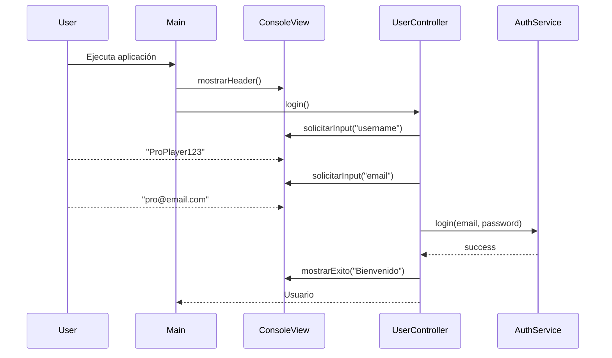
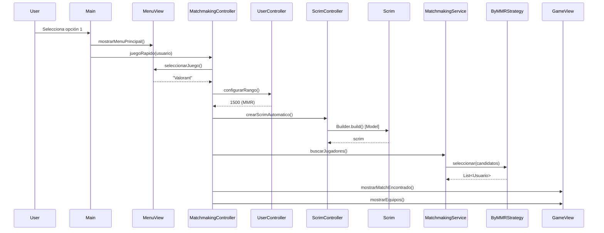

# 🏛️ Arquitectura MVC - eScrims Platform

**Versión**: 2.0-MVC
**Fecha**: 2025-11-10
**Patrón Arquitectural**: Model-View-Controller (MVC)

---

## 📐 Diagrama de Arquitectura

```
┌────────────────────────────────────────────────────────────────┐
│                        USER INPUT                              │
│                            ↓                                    │
│                    ┌───────────────┐                           │
│                    │   Main.java   │                           │
│                    │  Orchestrator │                           │
│                    └───────┬───────┘                           │
│                            │                                    │
│         ┌──────────────────┼──────────────────┐                │
│         │                  │                  │                │
│    ┌────▼────┐      ┌──────▼──────┐    ┌─────▼─────┐         │
│    │ VIEWS   │◄─────┤ CONTROLLERS │────►│ SERVICES  │         │
│    └─────────┘      └──────┬──────┘    └─────┬─────┘         │
│                            │                  │                │
│                            │            ┌─────▼─────┐         │
│                            └────────────►│  MODELS   │         │
│                                         └───────────┘         │
│                                               ↑                │
│                                               │                │
│                                    ┌──────────┴────────────┐  │
│                                    │  DESIGN PATTERNS      │  │
│                                    │  State, Strategy,     │  │
│                                    │  Observer, etc.       │  │
│                                    └───────────────────────┘  │
└────────────────────────────────────────────────────────────────┘
```

---

## 🎯 Responsabilidades por Capa

### LAYER 1: VIEW (Presentación)

**Ubicación**: `codigo/src/views/`

**Responsabilidad**: SOLO presentar información y capturar input

**Clases**:
1. **ConsoleView** - Utilidades generales de presentación
2. **MenuView** - Menús y opciones específicas
3. **GameView** - Vistas de gameplay

**Reglas**:
- ❌ NO contiene lógica de negocio
- ❌ NO modifica modelos directamente
- ❌ NO toma decisiones de flujo
- ✅ SOLO muestra datos
- ✅ SOLO captura input del usuario
- ✅ Delega decisiones a Controllers

**Ejemplo**:
```java
// ✅ CORRECTO - View solo presenta
public void mostrarScrim(Scrim scrim) {
    System.out.println("Juego: " + scrim.getJuego());
    System.out.println("Estado: " + scrim.getEstado());
}

// ❌ INCORRECTO - View NO debe modificar
public void confirmarScrim(Scrim scrim) {
    scrim.cambiarEstado(new EstadoConfirmado()); // ❌ Esto es lógica!
}
```

---

### LAYER 2: CONTROLLER (Orquestación)

**Ubicación**: `codigo/src/controllers/`

**Responsabilidad**: Orquestar flujo, coordinar View + Service + Model

**Clases**:
1. **UserController** - Gestión de usuarios (login, rango, roles)
2. **ScrimController** - Gestión de scrims (crear, buscar, postular)
3. **MatchmakingController** - Flujo de matchmaking completo

**Reglas**:
- ✅ Recibe input desde View
- ✅ Valida y procesa input
- ✅ Llama a Services para ejecutar lógica
- ✅ Orquesta múltiples Services si necesario
- ✅ Pasa resultados a View para presentar
- ❌ NO hace cálculos complejos (eso es Service)
- ❌ NO hace System.out.println (eso es View)

**Ejemplo**:
```java
// ✅ CORRECTO - Controller orquesta
public void juegoRapido(Usuario usuario, UserController userCtrl) {
    // 1. Capturar datos (via View)
    String juego = menuView.seleccionarJuego();

    // 2. Procesar (via Service)
    Scrim scrim = scrimController.crearScrimAutomatico(juego, rango);

    // 3. Presentar (via View)
    gameView.mostrarSalaCreada(scrim);
}

// ❌ INCORRECTO - Controller NO debe tener presentación
public void juegoRapido(Usuario usuario) {
    System.out.println("Selecciona juego:"); // ❌ Esto es View!
    Scrim scrim = new Scrim(...);           // ❌ Esto debería ser Service!
}
```

---

### LAYER 3: SERVICE (Lógica de Negocio)

**Ubicación**: `codigo/src/service/`

**Responsabilidad**: Ejecutar lógica de negocio, orquestar operaciones complejas

**Clases Existentes**:
1. **MatchmakingService** - Algoritmos de emparejamiento
2. **NotificationService** - Envío de notificaciones
3. **ScrimSearchService** - Búsqueda con filtros
4. **SalaManager** - Gestión centralizada de salas (Singleton)

**Reglas**:
- ✅ Contiene lógica de negocio pura
- ✅ Usa Strategies, States, y otros patrones
- ✅ Puede llamar a otros Services
- ✅ Retorna resultados (no presenta)
- ❌ NO hace System.out.println
- ❌ NO captura input del usuario
- ❌ NO conoce Views ni Controllers

**Ejemplo**:
```java
// ✅ CORRECTO - Service ejecuta lógica
public class MatchmakingService {
    public List<Usuario> buscarJugadores(List<Usuario> candidatos, Scrim scrim) {
        // Aplicar estrategia
        return strategy.seleccionar(candidatos, scrim);
    }
}

// ❌ INCORRECTO - Service NO debe presentar
public void buscarJugadores(...) {
    List<Usuario> result = strategy.seleccionar(...);
    System.out.println("Encontrados: " + result.size()); // ❌ Presentación!
}
```

---

### LAYER 4: MODEL (Dominio)

**Ubicación**: `codigo/src/models/`

**Responsabilidad**: Representar entidades de dominio y reglas de negocio del dominio

**Clases** (sin cambios):
1. **Usuario** - Jugador con rango y roles
2. **Scrim** - Partida con estado y configuración
3. **Equipo** - Grupo de jugadores
4. **Postulacion** - Solicitud de join
5. **Confirmacion** - Confirmación de participación
6. **Estadistica** - Datos post-partida
7. **ReporteConducta** - Reporte de jugador
8. **Notificacion** - Mensaje a enviar

**Reglas**:
- ✅ Representan conceptos del dominio
- ✅ Contienen reglas de validación del dominio
- ✅ Pueden usar patrones (State, Observer, Builder)
- ❌ NO conocen Views, Controllers, ni Services
- ❌ NO hacen I/O (lectura/escritura de archivos, DB, etc.)

---

## 🔄 Flujo de Comunicación MVC

### Flujo General

```
1. USER → interactúa con consola
             ↓
2. VIEW → captura input, muestra menú
             ↓
3. Main.java → detecta opción, llama Controller apropiado
             ↓
4. CONTROLLER → orquesta flujo
             ├─ Llama a View para capturar más datos
             ├─ Llama a Service para ejecutar lógica
             └─ Llama a View para mostrar resultado
             ↓
5. SERVICE → ejecuta lógica de negocio
             ├─ Usa Strategies
             ├─ Modifica Models
             └─ Retorna resultado
             ↓
6. VIEW → presenta resultado al usuario
```

---

### Ejemplo Concreto: Búsqueda de Salas

#### Flujo Detallado

```
[USER] Selecciona opción "2" en menú principal
  ↓
[Main.java:63]
  scrimController.buscarSalasDisponibles(usuario, userController);
  ↓
[ScrimController.buscarSalasDisponibles()]
  ├─ MenuView.seleccionarJuegoDesdeList()           ← Capturar input
  ├─ UserController.configurarRango()               ← Validar/configurar
  ├─ SalaManager.getSalasPorJuego()                 ← Service call
  ├─ ConsoleView.mostrarListaScrims(salas)          ← Presentar
  ├─ MenuView.seleccionarSala()                     ← Capturar input
  ├─ SalaManager.puedeUnirse()                      ← Validar
  └─ Si válido:
      ├─ MenuView.mostrarAccesoConcedido()          ← Feedback positivo
      └─ unirseASala() → continúa flujo
    Si inválido:
      └─ MenuView.mostrarAccesoDenegado()           ← Feedback negativo
```

#### Separación de Concerns

| Paso | Capa | Archivo | Responsabilidad |
|------|------|---------|-----------------|
| Mostrar menú | VIEW | MenuView | Presentar opciones |
| Seleccionar juego | VIEW | MenuView | Capturar selección |
| Obtener salas | SERVICE | SalaManager | Lógica de búsqueda |
| Validar acceso | SERVICE | SalaManager | Lógica de validación |
| Mostrar resultado | VIEW | MenuView / ConsoleView | Presentar feedback |
| Orquestar todo | CONTROLLER | ScrimController | Coordinar flujo |

---

## 🎨 Patrones de Diseño en MVC

### Integración de Patrones con MVC

#### State Pattern → MODEL Layer
```
models/Scrim.java
  ├─ Mantiene estado actual (ScrimState)
  └─ Delega comportamiento a estado

states/ScrimState.java (interface)
  ├─ EstadoBuscandoJugadores
  ├─ EstadoLobbyCompleto
  ├─ EstadoConfirmado
  ├─ EstadoEnJuego
  ├─ EstadoFinalizado
  └─ EstadoCancelado

CONTROLLER orquesta cambios:
  ScrimContext.cambiarEstado(new EstadoConfirmado());

VIEW presenta estados:
  GameView.mostrarEstadoActual(scrim.getEstado());
```

#### Strategy Pattern → SERVICE Layer
```
service/MatchmakingService.java
  ├─ Usa IMatchMakingStrategy
  └─ Ejecuta selección de jugadores

strategies/ByMMRStrategy implements IMatchMakingStrategy
  └─ seleccionar(candidatos, scrim) → List<Usuario>

CONTROLLER usa Service:
  List<Usuario> jugadores = matchmakingService.buscar(...);

VIEW muestra progreso:
  GameView.mostrarJugadorEncontrado(username, rango);
```

#### Observer Pattern → MODEL + SERVICE
```
models/Scrim.java (Subject)
  └─ addNotifier(INotifier)
  └─ notificarCambio(Notificacion)

notifiers/EmailNotifier implements INotifier (Observer)
  └─ sendNotification(Notificacion)

CONTROLLER suscribe observers:
  scrim.addNotifier(emailNotifier);

SERVICE dispara eventos:
  scrim.notificarCambio(new Notificacion(...));
```

#### Command Pattern → CONTROLLER Layer
```
commands/AsignarRolCommand implements IScrimCommand
  └─ execute(ScrimContext)
  └─ undo(ScrimContext)

CONTROLLER usa Command:
  MatchmakingController.gestionarRolesConComandos()
    ├─ CommandManager.ejecutarComando(comando)
    └─ CommandManager.deshacerUltimo()

VIEW presenta resultado:
  MenuView.mostrarRolesActuales(jugadores);
```

---

## 📁 Estructura de Directorios

### Estructura Completa

```
codigo/src/
│
├── main/                    ← ORCHESTRATION
│   ├── Main.java                 (118 líneas) - Entry point MVC
│   └── Main_OLD_BACKUP.java      (1624 líneas) - Demo completa
│
├── views/                   ← VIEW LAYER (Nuevo)
│   ├── ConsoleView.java          (200 líneas) - Presentación general
│   ├── MenuView.java             (210 líneas) - Menús específicos
│   └── GameView.java             (180 líneas) - Gameplay views
│
├── controllers/             ← CONTROLLER LAYER (Nuevo)
│   ├── UserController.java       (170 líneas) - Usuarios
│   ├── ScrimController.java      (190 líneas) - Scrims
│   └── MatchmakingController.java (220 líneas) - Matchmaking
│
├── service/                 ← SERVICE LAYER (Existente)
│   ├── MatchmakingService.java   - Algoritmos matchmaking
│   ├── NotificationService.java  - Notificaciones
│   ├── ScrimSearchService.java   - Búsqueda de scrims
│   └── SalaManager.java          - Gestión de salas (Singleton)
│
├── models/                  ← MODEL LAYER (Existente)
│   ├── Usuario.java              - Entidad jugador
│   ├── Scrim.java                - Entidad partida (con State)
│   ├── Equipo.java               - Grupo de jugadores
│   ├── Postulacion.java          - Solicitud de join
│   ├── Confirmacion.java         - Confirmación participación
│   ├── Estadistica.java          - Stats post-juego
│   ├── Notificacion.java         - Mensaje de notificación
│   └── ReporteConducta.java      - Reporte de conducta
│
└── [Patrones de Diseño]     ← CROSS-CUTTING
    ├── states/              - State Pattern (6 estados)
    ├── strategies/          - Strategy Pattern (3 estrategias) ✅ Fixed
    ├── notifiers/           - Observer + Factory + Composite
    ├── commands/            - Command Pattern (undo/redo)
    ├── validators/          - Template Method
    ├── adapters/            - Adapter Pattern
    └── moderators/          - Chain of Responsibility
```

---

## 🔀 Flujos de Caso de Uso

### CU1: Registro y Login



**Capas Involucradas**:
- VIEW: ConsoleView (captura input, muestra bienvenida)
- CONTROLLER: UserController (orquesta login)
- SERVICE: AuthService (valida credenciales)
- MODEL: Usuario (entidad creada)

---

### CU2: Juego Rápido (Matchmaking Automático)



**Capas Involucradas**:
- VIEW: MenuView, GameView (captura + presenta)
- CONTROLLER: MatchmakingController, ScrimController, UserController (orquesta)
- SERVICE: MatchmakingService (ejecuta matchmaking)
- MODEL: Scrim, Usuario (entidades)
- PATTERN: Strategy (ByMMRStrategy selecciona jugadores)

---

### CU3: Búsqueda de Salas Disponibles

```
User → Main → ScrimController.buscarSalasDisponibles()
                  ↓
          ┌───────┴────────┐
          │                │
    MenuView          UserController
    .seleccionar      .configurar
    JuegoDesdeList    Rango
          │                │
          └───────┬────────┘
                  ↓
          SalaManager.getSalasPorJuego() [Service]
                  ↓
          ConsoleView.mostrarListaScrims() [View]
                  ↓
          MenuView.seleccionarSala() [View]
                  ↓
          SalaManager.puedeUnirse() [Service - Validación]
                  ↓
          ┌───────┴────────┐
          │                │
   Si válido          Si inválido
   MenuView           MenuView
   .mostrar           .mostrar
   AccesoConcedido    AccesoDenegado
```

---

## 💡 Principios Aplicados

### Single Responsibility Principle (SRP)

**ANTES**:
```java
Main.java (1,624 líneas)
  → Responsabilidades: Presentación + Lógica + Orquestación + Demo
  → Razones para cambiar: Cambiar UI, cambiar lógica, cambiar flujo, cambiar demo
```

**DESPUÉS**:
```java
ConsoleView.java (200 líneas)
  → Responsabilidad: SOLO presentación
  → Razón para cambiar: Cambiar formato de presentación

UserController.java (170 líneas)
  → Responsabilidad: SOLO orquestación de usuarios
  → Razón para cambiar: Cambiar flujo de login/registro

MatchmakingService.java
  → Responsabilidad: SOLO lógica de matchmaking
  → Razón para cambiar: Cambiar algoritmo de emparejamiento
```

---

### Dependency Inversion Principle (DIP)

**Controllers dependen de abstracciones**:
```java
public class MatchmakingController {
    private ConsoleView consoleView;    // ← Concrete (pero View pura)
    private MatchmakingService service;  // ← Concrete (pero Service)
}
```

**Services dependen de interfaces**:
```java
public class MatchmakingService {
    private IMatchMakingStrategy strategy; // ← Abstracción ✅

    public void setStrategy(IMatchMakingStrategy strategy) {
        this.strategy = strategy;
    }
}
```

---

### Open/Closed Principle (OCP)

**Extensión sin modificación**:

Agregar nuevo tipo de vista (ej: WebView):
```java
// 1. Crear nueva View (abierto para extensión)
public class WebView {
    public void mostrarScrim(Scrim scrim) {
        return "<div>" + scrim.getJuego() + "</div>";
    }
}

// 2. Inyectar en Controller (sin modificar Controllers existentes)
ScrimController scrimCtrl = new ScrimController(
    new WebView(), menuView, gameView // ← Sustituir ConsoleView
);
```

No requiere modificar código de ScrimController (cerrado para modificación).

---

## 🧩 Integración de Patrones con MVC

### State Pattern en MVC

**MODEL contiene estado**:
```java
// models/Scrim.java
private ScrimState estado;

public void cambiarEstado(ScrimState nuevo) {
    this.estado = nuevo;
}
```

**CONTROLLER orquesta transiciones**:
```java
// controllers/MatchmakingController.java
context.cambiarEstado(new EstadoLobbyCompleto());
context.cambiarEstado(new EstadoConfirmado());
```

**VIEW presenta estado**:
```java
// views/GameView.java
public void mostrarEstadoActual(String estado) {
    consoleView.mostrarExito("Estado actual: " + estado);
}
```

---

### Strategy Pattern en MVC (CORREGIDO)

**SERVICE usa Strategy**:
```java
// service/MatchmakingService.java
public List<Usuario> buscarJugadores(List<Usuario> candidatos, Scrim scrim) {
    return strategy.seleccionar(candidatos, scrim); // ✅ Strategy selecciona
}
```

**CONTROLLER provee candidatos**:
```java
// controllers/MatchmakingController.java
List<Usuario> candidatos = generarCandidatos(scrim);
List<Usuario> seleccionados = matchmakingService.buscarJugadores(candidatos, scrim);
```

**VIEW muestra progreso**:
```java
// views/GameView.java
for (Usuario jugador : seleccionados) {
    mostrarJugadorEncontrado(jugador.getUsername(), jugador.getRango());
}
```

---

### Observer Pattern en MVC

**MODEL es Subject**:
```java
// models/Scrim.java
private List<INotifier> notifiers = new ArrayList<>();

public void notificarCambio(Notificacion notif) {
    for (INotifier n : notifiers) {
        n.sendNotification(notif);
    }
}
```

**CONTROLLER suscribe Observers**:
```java
// controllers/MatchmakingController.java
scrim.addNotifier(emailNotifier);
scrim.addNotifier(discordNotifier);
```

**SERVICE dispara eventos**:
```java
// service/NotificationService.java
public void notificarLobbyCompleto(List<Usuario> jugadores, Scrim scrim) {
    Notificacion notif = new Notificacion("LOBBY_COMPLETO", mensaje);
    scrim.notificarCambio(notif); // ← Notifica a observers
}
```

---

### Command Pattern en MVC

**MODEL define comandos**:
```java
// commands/AsignarRolCommand implements IScrimCommand
public void execute(ScrimContext ctx) {
    usuario.setRol(rol);
}
```

**CONTROLLER ejecuta comandos**:
```java
// controllers/MatchmakingController.java
public void gestionarRolesConComandos(...) {
    CommandManager manager = new CommandManager(context);
    AsignarRolCommand cmd = new AsignarRolCommand(usuario, rol);
    manager.ejecutarComando(cmd);
}
```

**VIEW muestra menú de comandos**:
```java
// views/MenuView.java
public int mostrarMenuGestionRoles() {
    System.out.println("[1] Cambiar rol de un jugador");
    System.out.println("[2] Intercambiar roles");
    System.out.println("[3] Deshacer último cambio"); // ← Undo
    return solicitarNumero(...);
}
```

---

## 📚 Guía de Uso para Desarrolladores

### Agregar Nueva Funcionalidad

#### Ejemplo: Agregar "Historial de Partidas"

**1. MODEL** - Crear entidad de dominio
```java
// models/HistorialPartida.java
public class HistorialPartida {
    private Usuario usuario;
    private Scrim scrim;
    private String resultado; // "Victoria", "Derrota"
    private int mvpVotes;
}
```

**2. SERVICE** - Crear lógica de negocio
```java
// service/HistorialService.java
public class HistorialService {
    public List<HistorialPartida> obtenerHistorial(Usuario usuario) {
        // Lógica de búsqueda
    }

    public void registrarPartida(Usuario usuario, Scrim scrim, String resultado) {
        // Lógica de registro
    }
}
```

**3. VIEW** - Crear vista
```java
// views/GameView.java (agregar método)
public void mostrarHistorial(List<HistorialPartida> historial) {
    mostrarSubtitulo("HISTORIAL DE PARTIDAS");
    for (HistorialPartida partida : historial) {
        System.out.println("• " + partida.getScrim().getJuego() +
                          " - " + partida.getResultado());
    }
}
```

**4. CONTROLLER** - Orquestar flujo
```java
// controllers/UserController.java (agregar método)
public void mostrarHistorial(Usuario usuario) {
    List<HistorialPartida> historial = historialService.obtener(usuario);
    gameView.mostrarHistorial(historial);
}
```

**5. MAIN** - Agregar al menú
```java
// main/Main.java (agregar case)
case 5:
    userController.mostrarHistorial(usuarioActual);
    break;
```

**Resultado**: Nueva funcionalidad sin modificar código existente (OCP).

---

## 🔍 Testing con MVC

### Ventajas de Testeo

#### ANTES (Monolítico):
```java
// ❌ NO TESTEABLE - Main.java con System.out y Scanner
public class MainTest {
    @Test
    public void testJuegoRapido() {
        // ¿Cómo mockear System.out?
        // ¿Cómo simular Scanner input?
        // ❌ Imposible testear
    }
}
```

#### DESPUÉS (MVC):
```java
// ✅ TESTEABLE - Controllers con dependencias inyectables
public class MatchmakingControllerTest {

    @Test
    public void testJuegoRapido() {
        // Arrange
        ConsoleView mockView = mock(ConsoleView.class);
        MenuView mockMenu = mock(MenuView.class);
        MatchmakingController controller = new MatchmakingController(mockView, mockMenu, ...);

        // Act
        controller.juegoRapido(usuario, userController);

        // Assert
        verify(mockView).mostrarExito(contains("Match encontrado"));
    }
}
```

### Capas Testeables Independientemente

| Capa | Testeable | Cómo |
|------|-----------|------|
| **View** | ✅ Sí | Mock Scanner, capturar System.out |
| **Controller** | ✅ Sí | Mock Views y Services |
| **Service** | ✅ Sí | Unit tests puros |
| **Model** | ✅ Sí | Unit tests puros |

---

## 🎓 Beneficios de la Refactorización

### 1. Mantenibilidad

**Cambiar formato de presentación**:
- ANTES: Modificar 50+ lugares en Main.java
- DESPUÉS: Modificar solo `ConsoleView.mostrarTitulo()`

### 2. Testabilidad

**Testear flujo de matchmaking**:
- ANTES: Imposible (System.out + Scanner en Main)
- DESPUÉS: Fácil (mock Views, test Controllers)

### 3. Extensibilidad

**Agregar GUI en vez de consola**:
- ANTES: Reescribir todo Main.java
- DESPUÉS: Crear `SwingView implements IView`, inyectar en Controllers

### 4. Reutilizabilidad

**Usar ScrimController en API REST**:
- ANTES: Imposible (lógica mezclada con consola)
- DESPUÉS: Fácil (ScrimController es independiente de presentación)

### 5. Colaboración en Equipo

**Trabajo paralelo**:
- ANTES: 1 persona en Main.java (merge hell)
- DESPUÉS: 3 personas (1 en Views, 1 en Controllers, 1 en Services)

---

## ⚖️ Trade-offs

### Ventajas

✅ **Arquitectura profesional** - Cumple MVC specification
✅ **Código mantenible** - Cada clase < 250 líneas
✅ **Separación clara** - View/Controller/Service/Model
✅ **Testeable** - Cada capa independiente
✅ **Extensible** - Fácil agregar funcionalidad

### Desventajas

⚠️ **Más archivos** - 6 archivos nuevos vs 1 Main.java
⚠️ **Overhead inicial** - Requiere entender arquitectura
⚠️ **Indirección** - Más saltos entre archivos

**Veredicto**: Trade-offs valen la pena para proyecto académico y profesional.

---

## 📖 Referencias

- **Gang of Four**: Design Patterns (State, Strategy, Command, etc.)
- **Martin Fowler**: Patterns of Enterprise Application Architecture (MVC)
- **Robert C. Martin**: Clean Architecture (Dependency Rule)
- **Especificación del TP**: TPO Final – E Sports Scrims Matchmaking.pdf

---

**Status**: ✅ Refactorización Completa
**Próximo**: Actualizar README.md y UML con arquitectura MVC
